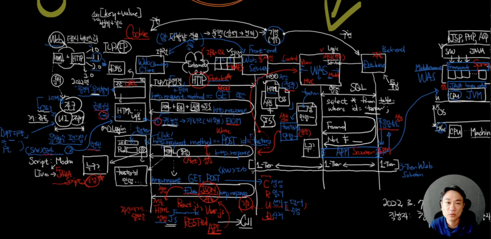

```toc
exclude: Table of Contents
tight: true
ordered: true
from-heading: 1
to-heading: 6
```

# Goal

write easy-to-understand & comprehensive article about a system


# How
1. find an important question that encompasses every major aspect of the system
2. show architecture diagram of the system
3. find smallest, and yet essential unit that is dealt with every module of the system
4. divide heading by module, explain briefly what and how of that module works in relation to the unit


## Example


Q. explain about computer Network

1. Q. what happen when I type google.com on browser?
2. show overall architecture in single picture including OSI 7 layer, LAN
3. packet
4. explain how packet is created, sent, and dealt by each module within that architecture. make sure to divide header by level of module abstraction(ex. client, LAN, Server starts with single '#', OSI Layer would start with double '#', ARP, TCP/IP, HTTP would start with triple '#', etc)


every important concepts should be abstracted and compressed into a single picture
ex.


